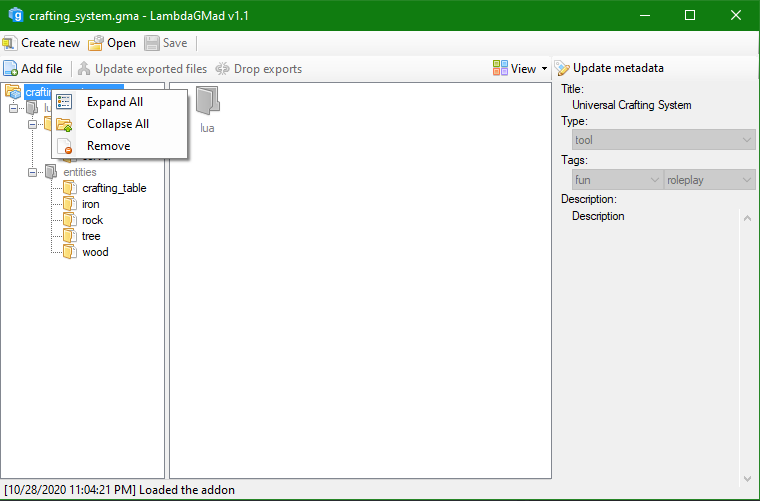

SharpGMad
=========

SharpGMad is a tool used to manipulate [Garry's
Mod](http://en.wikipedia.org/wiki/Garry%27s_Mod) workshop addon packages
(_.gma_ files).

The program had been originally created as a straight reimplementation in
C# of Garry Newman's [GMad](http://github.com/garrynewman/gmad), but over
time, it was given an extended set of functionality, most notably the
graphical interface and realtime access.

(The current version implements and complies with
[`a121a70`](http://github.com/garrynewman/gmad/tree/a121a70e298ab6e07fa77a5e4f72018c7480f758).)

Usage
-----

### Realtime mode

This is the main feature and reason for SharpGMad's existence. While gmad
can only fully pack a folder into an addon or fully extract an addon to a
folder, with SharpGMad, you can effectively browse a file just as how you
would be browsing any other archive (for example, ZIP, RAR or TAR files).

The realtime mode supports **on-the-fly** adding, removing and updating of
files. Using the _Export_ feature, a single file can be exported anywhere
on your filesystem and edited with any appropriate editor. When you are
done with the changes, a single click of a button will _pull_ these
changes into the archive.

Both a graphical and a command-line interface is available for realtime
mode.

#### GUI

`SharpGMad [path]`

If the program is started with no command-line arguments (or only one, and
that is a file path), a graphical interface will load. (You can also
**drag & drop** a file in your file explorer onto SharpGMad's executable
to open it automatically.)

#### Terminal

`SharpGMad realtime`

Starting SharpGMad with the _realtime_ argument from the terminal loads
its shell. If you are more savvy with using the terminal for quick
operation, this mode is for you. Every operation possible in the graphical
mode has a counterpart in the terminal (and vice-versa).

Type `help` in the shell to see a list of available commands.

Optionally, you can specifiy a file as an extra argument to have it loaded
initally:

`SharpGMad realtime -file "C:\steam\etc\garrysmod\addons\my_addon_12345.gma"`

### `gmad` mode

SharpGMad provides the legacy interface of gmad just in case a gmad binary
is not at hand, so you can execute the "legacy" full-extract and
full-create operations the same way you would with gmad. (Just type
`SharpGMad` instead of `gmad` as the executable's name.)

As per [gmad's
manual](https://github.com/garrynewman/gmad/tree/a121a70e298ab6e07fa77a5e4f72018c7480f758#usage):

#### Create new GMA file from a folder

`SharpGMad create -folder "C:\path\to\addon\folder\" -out "C:\where\to\save\file\out.gma"`

#### Extract an existing file

`SharpGMad extract -file "C:\steam\etc\garrysmod\addons\my_addon_12345.gma" -out "C:\this\folder"`

### Conversion mode

The so-called _loose_ addon structures used in Garry's Mod 12 (subfolders
of the `addons` folder containing each and every file of the addon on the
hard disk) are also supported for conversion.

SharpGMad will use an existing `info.txt` file to load the metadata of the
addon. Any missing metadata will be asked from the user.

When converting from a folder, SharpGMad auto-discovers whether it is an
old structure or a "new", gmad-compatible structure.

When extracting a gma, you can specify `-gmod12` as an extra argument of
the `extract` command if you wish to extract to the old layout.

Corresponding options for back-and-forth conversion are available on the
graphical interface, under the option _Legacy operations_.

Compiling and requirements
--------------------------

SharpGMad is written using the .NET 4.0 framework. This is the only
requirement, you can compile the solution with any development environment
on any computer compatible with .NET 4.0.

This usually means a computer with at least Windows XP Service Pack 3
installed.

Cross-platform operation with [Mono](http://www.mono-project.com/) is also
supported, though in **BETA**. Mono has its hiccups (especially with the
grahpical interface) here and there, but I try to do my best to test and
iron everything out.

**CAUTION!** Most Linux distributions tend to install an old version of
Mono (like 2.10) by default. Such old versions _have_ compatibility
issues. Please acquire a newer version, for example 3.2.5, as it and
SharpGMad tend to be more compatible.

Disclaimer
----------

The program _SharpGMad_ is provided "AS IS" without any expressed or
implied warranties. 

It is a general rule of thumb that you should **NEVER** start editing
files you hadn't made backup of beforehand. The creators refuse to be held
liable for any damange caused by the usage of this piece of software.
